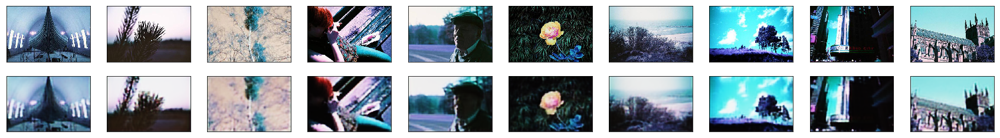

# Lomoencoder

##Using Autoencoders with Analogue Photographs

#### Introduction

This project was done as part of the Panic Room module during my first year in IDE (Innovation Design Engineering), a double masters run by Imperial College London and the Royal College of Art. We were introduced to machine learning and artficial intelligence thanks to researchers at Imperial College, and after a series of exercises in Python, we were given the opportunity to create our own exercise.

My aim was to use a fascinating element of machine learning and neural networks called autoencoders. Autoencoders consist of an encoder and a decoder, and they can be trained on data without any classification. When trained, they learn how to reconstruct each **output** as close as possible to the **input**. By doing so they start to develop an implicit, compressed understanding of the specific features of the data used at the input, which is represented as a **code**.

<!--
*Autoencoder with RGB Images*-->

What is interesting about autoencoders is that they have the potential to learn the content of a dataset, and then generate new data that isn't present in the input dataset, yet is very similar (and inspired by) the input data. My aim was to perform this kind of operation with images taken from the [Lomography.com](https://www.lomography.com/photos/) website, which allows users to post photos taken with analogue cameras. The idea would therefore be to train an autoencoder on a set of analogue images, and then try to make it generate new images which look like real analogue pictures, but are completely digital and don't exist in real life.

#### Downloading images from Lomography

The first step was to use a Python Jupyter Notebook to parse webpages from the [Lomography.com](https://www.lomography.com/photos/) website and download pictures taken with a specific type of analogue film that significantly alters the colours of the scene. Ideally the autoencoder would learn how to produce pictures of such style, and generate new ones that look like they were taken using this expensive film.

In this step I also had to do some pre-processing on the images to make them have the same dimensions, resolution, etc. therefore I had to crop and re-size them several times. I downloaded 10,000 images but ended up using only 2,000 to train the autoencoder.

*For this step please see the 'Image Download & Processing' files.*

#### Training the autoencoder

The second step was to train the autoencoder using 2,000 images. I trained the autoencoder for 25 epochs (very small for real applications but very long for a MacBook Pro). 

After the training is done, I tested the autoencoder to see if it could encode and decode other images from my dataset. As you can see from the images below, it works rather well when the encoder and decoder are attached (input is at the top, autoencoded output is at the bottom).

#### Detatching the encoder and the decoder

This is where it gets interesting. Now that we have verified that out autoencoder can reconstruct inputs relatively well, we can try to detach the decoder from the encoder to use them separately. Remember our intent is to feed in random data at the input of the decoder and see what comes out. 

Again to prevent any mistakes, after detatching the encoder and decoder I tried to test them separately by first making the encoder compress the input data, and then making the decoder decompress the output of the encoder. Unfortunately, as you can see from the image below, it doesn't work quite yet.

What is very strange and yet promising is that the 'grey' images aren't actually all grey... they are like dimmed down versions of the input. I tried to 'boost' the individual pixels on one image to see what it looked like and indeed, the features of the image are still there, but the colours arent. 

*Output of the autoencoder (encoder+decoder together)*

*Output of the decoder after being detached from encoder, and after boosting of pixels*

#### Next steps
There seems to be something wrong in the code somewhere because everything seems to be there yet the output isn't completely correct. With a little more investigation I will probably be able to fix this and then move on to the most exciting part, which is to feed random data to the decoder to generate new images. Fingers crossed!